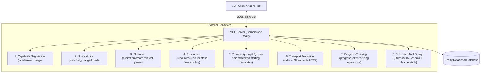

# 🏠 Cornerstone Realty Group — Model Context Protocol (MCP) Server Lab

> **Course**: Autonomous Agents & AI Systems Lab — Session 2 (MCP Server Lab)  
> **Team Name**: Cornerstone Realty Group B  
> **Repository**: `abdallahsaber065/mcp-server-lab`  

---

## 👥 Team Members & Contribution Split

| Name | GitHub Username | Role & Responsibilities |
| :--- | :--- | :--- |
| **Abdallah Saber** | [`abdallahsaber065`](https://github.com/abdallahsaber065) | Team Lead, MCP Server Core, Capability Negotiation, Elicitation & FastAPI |
| **Omar Tamer** | [`omar-tamer976`](https://github.com/omar-tamer976) | Database Architecture (DDL, Seed Data, ERD), Resources & Prompts |
| **Ahmed Wael** | [`ahmedeladawy16`](https://github.com/ahmedeladawy16) | Notifications, Progress Tracking, Client Agent & Integration Tests |

---

## 📌 Problem Framing & Real-World Domain

**Cornerstone Realty Group** manages residential and commercial properties across Cairo and Alexandria. Property managers, lease agents, and maintenance engineers require intelligent assistance to query lease terms, schedule unit viewings, and process maintenance orders.

Giving an LLM direct, raw SQL or shell access to the production real-estate database creates major operational risks:
- Risk of raw SQL injection or accidental data corruption (`DROP TABLE`, `UPDATE` without `WHERE`).
- Unauthorized lease modifications or unapproved discount approvals.
- High latency and unconstrained DB queries.

### The MCP Solution
We build an **MCP Server** sitting strictly in front of the SQLite/PostgreSQL relational database. The LLM host communicates exclusively via JSON-RPC 2.0 messages over standard transports (`stdio` for local dev, `Streamable HTTP` for production), ensuring all write operations and data accesses pass through defensive server-side validation and human sign-off.

---

## 🛠️ The 8 MCP Protocol Concerns Implemented



---

## 📁 Repository Structure

```text
.
├── README.md               # Architecture, ERD, and protocol documentation
├── .env.example            # Environment variable template
├── AGENTS.md               # Master rules and guidelines for AI agent assistance
├── db/                     # Relational schema, seed data, and Mermaid ERD
├── mcp_server/             # MCP Server codebase (FastMCP / MCP SDK)
│   ├── server.py           # Core server entry point
│   ├── tools/              # Defensive tool definitions
│   ├── resources/          # Static policy resources
│   └── prompts/            # Parameterized prompt templates
├── agent/                  # MCP Client agent & handshake verification
├── tests/                  # Executable unit & integration tests (pytest)
└── benchmarks/             # Performance & protocol latency measurements
```

---

## 🚀 Quickstart & Setup

### 1. Prerequisites
- Python 3.11+ powered by [`uv`](https://github.com/astral-sh/uv)
- GitHub CLI (`gh`)

### 2. Environment Setup
```powershell
# Copy environment template
cp .env.example .env

# Install dependencies using uv
uv sync
```

### 3. Run Executable Tests
```powershell
uv run pytest tests/
```

---

## 📜 License & Compliance
Built for the Autonomous Agents Lab Course. All code is licensed under the MIT License.
