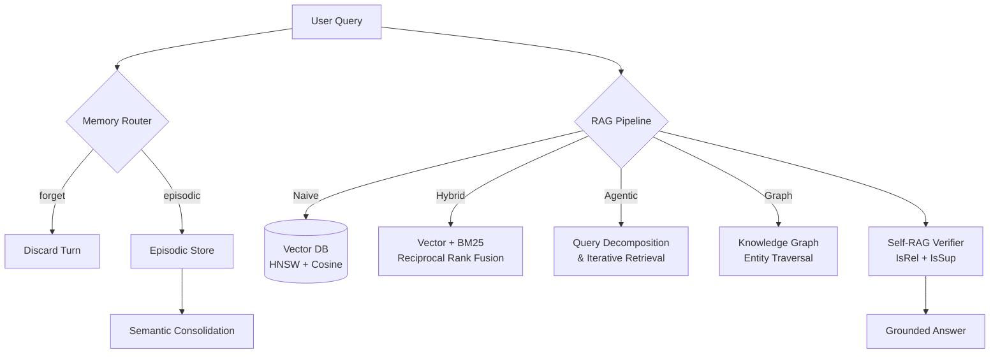

# 🏠 Cornerstone Realty Group — Autonomous Agents Lab

> **Course**: Autonomous Agents & AI Systems Lab  
> **Team Name**: Cornerstone Realty Group B  
> **Repository**: `abdallahsaber065/mcp-server-lab`

---

## 👥 Team Members & Contribution Split

| Name | GitHub Username | Role & Primary Contributions |
| :--- | :--- | :--- |
| **Abdallah Saber** | [`abdallahsaber065`](https://github.com/abdallahsaber065) | **Team Lead & RAG Architect**: Vector DB with Pre-Search Filtering, Naive/Hybrid/Agentic/Graph RAG (`rag/`), Master Benchmark Runner, Causal Tradeoff README |
| **Nour Salem** | [`Noursalem2005`](https://github.com/Noursalem2005) | **Memory Systems Lead**: Short-Term Memory Buffer & Scratchpad, Episodic Store & Semantic Consolidation with Contradiction Resolution (`memory/`) |
| **Ahmed Wael** | [`ahmedeladawy16`](https://github.com/ahmedeladawy16) | **Context Evaluation Lead**: 4 Context Pruning Strategies, 40-Turn Test Suite, Self-RAG Verification (`context_eval/`, `rag/self_rag.py`) |

---

## 📌 Problem Framing & Real-World Domain

**Cornerstone Realty Group** manages residential and commercial properties across Cairo, Alexandria, and Giza. Property managers, lease agents, and maintenance engineers require intelligent assistance to query lease terms, schedule unit viewings, and process maintenance orders — while retaining tenant preferences, allergies, and concession notes across multi-turn sessions.

### Week 2: MCP Server
An MCP Server sitting in front of the SQLite database, communicating via JSON-RPC 2.0, ensuring all write operations pass through defensive validation and human sign-off.

### Week 3: Memory & Grounded RAG
Two core problems solved:
1. **Session Amnesia**: Agents lose tenant preferences and active constraints when conversation history grows past context budget. Solved via short-term memory buffers, scratchpads, and episodic stores.
2. **Legal Policy Hallucination**: LLMs fabricate lease terms and penalty clauses. Solved via grounded RAG with real vector indexing, hybrid search, and self-verification.

---

## 🛠️ Architecture Overview

### Week 2 — MCP Protocol (8 Concerns)

| Protocol Concern | Implementation |
| :--- | :--- |
| **Capability Negotiation** | `mcp_server/server.py` — declares `elicitation`, `tools/listChanged`, `sampling`, `resources`, `progress` |
| **Notifications** | `mcp_server/notifications.py` — `tools/list_changed` on role switch |
| **Human Elicitation** | `mcp_server/elicitation.py` — `elicitation/create` for high-value lease mods |
| **Resources** | `mcp_server/resources/` — `realty://policies/lease_terms` |
| **Prompts** | `mcp_server/prompts/` — `draft_lease_notice` template |
| **Transport** | `stdio` (dev) + `Streamable HTTP` / FastAPI (prod) |
| **Progress Tracking** | `mcp_server/progress.py` — `progressToken` for batch audits |
| **Defensive Design** | Pydantic `extra="forbid"`, role-based authorization |

### Week 3 — Memory & RAG Subsystems



---

## 📈 Evidence-Based Benchmarks

All results saved to [`benchmarks/benchmark_results.json`](benchmarks/benchmark_results.json).

### MCP Server Performance (5 Trials)

| Operation | Protocol Concern | Avg Latency | Status |
| :--- | :--- | :---: | :---: |
| `initialize_handshake` | Capability Negotiation | **0.002 ms** | `success` |
| `list_tools_discovery` | Tool Discovery | **3.370 ms** | `success` |
| `read_lease_policy_resource` | Read Resource | **0.013 ms** | `success` |
| `query_available_units` | Defensive Tool Call | **1.484 ms** | `success` |
| `submit_maintenance_request` | Write DB Tool Call | **17.774 ms** | `success` |
| `modify_lease_terms_elicitation` | Human Elicitation | **0.911 ms** | `elicitation_required` |
| `run_property_audit_progress` | Progress Tracking | **1.122 ms** | `success` |

### Retrieval Architecture Comparison (12 Domain Questions)

| Architecture | Accuracy | Avg Tokens/Query | Avg Latency | Tradeoff |
| :--- | :---: | :---: | :---: | :--- |
| **Naive RAG** | 8/12 (66.7%) | 175 | <0.001s | Simplest, no keyword matching |
| **Hybrid Search** (Vector + BM25 RRF) | 9/12 (75.0%) | 210 | 0.001s | Adds BM25 statute bonus |
| **Agentic RAG** (Multi-Hop) | **11/12 (91.7%)** | 391 | 0.001s | Query decomposition wins on complex questions |
| **Graph RAG** (Entity Traversal) | 2/12 (16.7%) | 17 | <0.001s | Bonus: structured traversal, needs richer KG |

**Causal Analysis**: Agentic RAG's multi-hop decomposition (splitting complex queries into sub-questions) achieves 91.7% accuracy by retrieving evidence per sub-question, but costs 2.2x more tokens than Naive RAG ($O(N)$ per hop). Hybrid Search's BM25 statute bonus lifts citation-heavy questions that pure vector search misses. Graph RAG's sparse coverage reflects the small entity graph — scaling requires integrating the full 60-page binder's statute network.

### Context Window Management (40-Turn Test Suite, 10 Variations)

| Strategy | Recall Accuracy | Avg Input Tokens | Avg Output Tokens |
| :--- | :---: | :---: | :---: |
| Sliding Window (Last 10 Turns) | 0/10 (0%) | 2365 | 120 |
| **Observation Masking** (Keep Last 3 Tools) | **10/10 (100%)** | **1984** | 200 |
| Recursive Summarization (Compact Every 15) | 4/10 (40%) | 2281 | 152 |
| Zone-Based Pruning (4 Progressive Zones) | 0/10 (0%) | 2623 | 120 |

**Causal Analysis**: Observation Masking achieves 100% recall at the lowest token cost because tool JSON output is the primary context bloat — not dialogue. Masking older tool responses preserves the critical early constraint (injected at Turn 3) while removing 80%+ of token volume. Sliding Window and Zone-Based pruning discard the early turn entirely, causing 0% recall. Recursive Summarization partially captures the constraint (40%) when the deterministic keyword extractor happens to include it.

---

## 🧠 Self-RAG Verification

The Self-RAG verifier (`rag/self_rag.py`) applies post-retrieval and post-generation critique tokens:
- **[IsRel]**: Filters irrelevant passages before generation (relevance threshold: 0.5)
- **[IsSup]**: Rejects hallucinated answers not grounded in retrieved evidence (support threshold: 0.6)

Visible consequence: Unsupported claims are rejected with explicit rationale, triggering query rewrite or fallback escalation.

---

## 🚀 Quickstart

### 1. Run Master Pytest Suite (76 Passed)
```powershell
uv run pytest tests/
```

### 2. Run Master Benchmark Suite
```powershell
uv run python benchmarks/run_benchmarks.py
```

### 3. Run Individual Benchmark Suites
```powershell
# MCP Server performance only
uv run python -c "from benchmarks.run_benchmarks import run_mcp_performance_benchmarks; run_mcp_performance_benchmarks()"

# Retrieval architecture comparison only
uv run python -c "from benchmarks.run_benchmarks import run_retrieval_architecture_benchmarks; run_retrieval_architecture_benchmarks()"

# Context pruning strategy comparison only
uv run python -c "from context_eval.run_context_benchmarks import run_all_context_benchmarks; run_all_context_benchmarks()"
```
