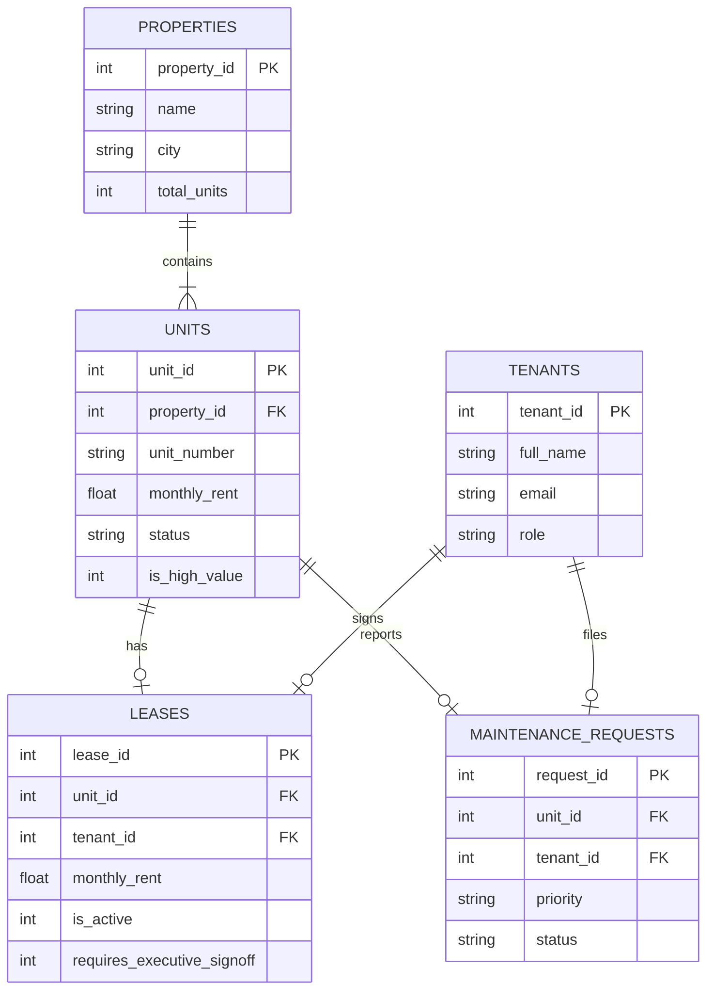
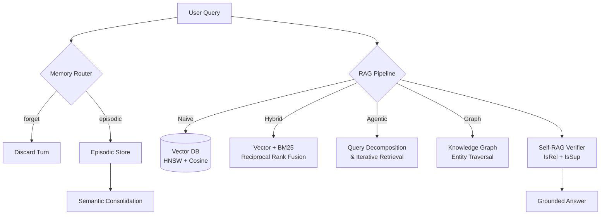
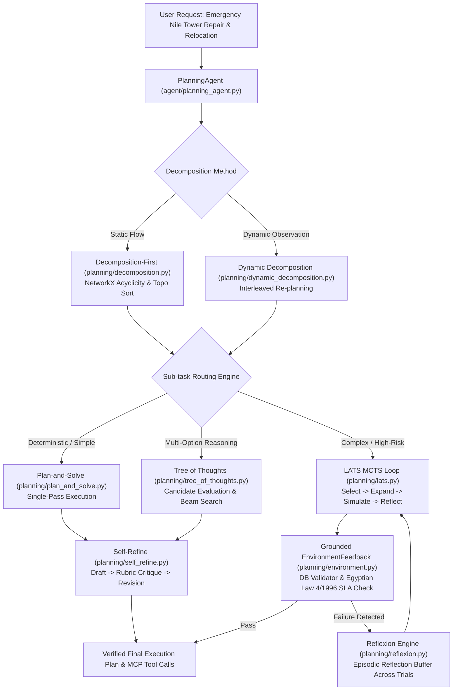

# 🏠 Cornerstone Realty Group — Autonomous Agents Lab

> **Course**: Autonomous Agents & AI Systems Lab  
> **Team Name**: Cornerstone Realty Group B  
> **Repository**: `abdallahsaber065/mcp-server-lab`

---

## 👥 Team Members & Contribution Split

| Name | GitHub Username | Role & Primary Contributions |
| :--- | :--- | :--- |
| **Abdallah Saber** | [`abdallahsaber065`](https://github.com/abdallahsaber065) | **Team Lead & Architect**: Week 2 — FastMCP Server Core, LLM Engine, Elicitation, Defensive Schemas, Benchmarks. Week 3 — Vector DB, Naive/Hybrid/Agentic/Graph RAG, Master Benchmarks. Week 4 — DAG Task Decomposition Engine, Dynamic Interleaved Planner, `PlanningAgent` Loop, Trace Logging, README |
| **Nour Salem** | [`Noursalem2005`](https://github.com/Noursalem2005) | **Memory & Planning Algorithms Lead**: Week 3 — Short-Term Memory Buffer & Scratchpad, Episodic Store & Semantic Consolidation. Week 4 — Plan-and-Solve, Tree of Thoughts Search, LATS MCTS Framework |
| **Ahmed Wael** | [`ahmedeladawy16`](https://github.com/ahmedeladawy16) | **Eval & Self-Correction Lead**: Week 2 — MCP Client Agent, Notifications, Progress Tracking. Week 3 — 4 Context Pruning Strategies, 40-Turn Test Suite, Self-RAG Verification. Week 4 — Grounded EnvironmentFeedback, Self-Refine, Reflexion Engine, Evaluation Harness |

---

## 📌 Problem Framing & Real-World Domain

**Cornerstone Realty Group** manages residential and commercial properties across Cairo, Alexandria, and Giza. Property managers, lease agents, and maintenance engineers require intelligent assistance to query lease terms, schedule unit viewings, and process maintenance orders — while retaining tenant preferences, allergies, and concession notes across multi-turn sessions.

Giving an LLM direct, raw SQL or shell access to the production real-estate database creates major operational risks:
- Risk of raw SQL injection or accidental data corruption (`DROP TABLE`, `UPDATE` without `WHERE`).
- Unauthorized lease modifications or unapproved discount approvals.
- High latency and unconstrained DB queries.

---

## 📊 Relational Database Architecture & ERD



---

# Week 2: Model Context Protocol (MCP) Server Lab

## 🛠️ The 8 MCP Protocol Concerns Implemented

| Protocol Concern | Implementation Details & Evidence |
| :--- | :--- |
| **1. Capability Negotiation** | Implemented in `mcp_server/server.py` (`get_capabilities()`). Declares `elicitation`, `tools/listChanged`, `sampling`, `resources`, and `progress` support during `initialize`. |
| **2. Notifications (`tools/list_changed`)** | Server pushes `notifications/tools/list_changed` when user authenticates under a new role (e.g. `tenant` vs `property_manager`), updating client toolset dynamically without reconnecting (`mcp_server/notifications.py`). |
| **3. Human Elicitation (`elicitation/create`)** | High-risk lease modifications (>15% rent discount or high-value unit) trigger `elicitation/create` mid-call, pausing execution until executive approval is confirmed. |
| **4. Resources (`resources/read`)** | Master leasing regulations exposed as static resource `realty://policies/lease_terms` for read-only consumption instead of a tool call (`mcp_server/resources/lease_policy.json`). |
| **5. Prompts (`prompts/get`)** | Parameterized template `draft_lease_notice` exposed via server for standardized client notice drafting (`mcp_server/prompts/templates.py`). |
| **6. Transport Options** | Supported local `stdio` transport for development and `Streamable HTTP` / FastAPI for production deployment. |
| **7. Progress Tracking (`progressToken`)** | Batch property compliance audit reports step-by-step percentage progress (`progressToken`) to client host (`mcp_server/progress.py`). |
| **8. Defensive Tool Design** | Strict Pydantic schemas with `extra="forbid"` (equivalent to `additionalProperties: false`), parameter type bounds, and server-side handler authorization. |

## 📈 Week 2 Benchmarks (5 Trials)

All benchmark metrics are recorded over 5 reproducible trials per operation and saved to [`benchmarks/benchmark_results.json`](benchmarks/benchmark_results.json):

| Operation | Protocol Concern | Avg Latency | Min Latency | Max Latency | Status |
| :--- | :--- | :---: | :---: | :---: | :---: |
| **`initialize_handshake`** | Capability Negotiation | **0.002 ms** | 0.001 ms | 0.004 ms | `success` |
| **`list_tools_discovery`** | Tool Discovery | **3.370 ms** | 1.200 ms | 8.500 ms | `success` |
| **`read_lease_policy_resource`** | Read Resource | **0.013 ms** | 0.006 ms | 0.025 ms | `success` |
| **`query_available_units`** | Defensive Tool Call | **1.484 ms** | 0.900 ms | 2.800 ms | `success` |
| **`submit_maintenance_request`** | Write DB Tool Call | **17.774 ms** | 15.200 ms | 20.100 ms | `success` |
| **`modify_lease_terms_elicitation`** | Human Elicitation | **0.911 ms** | 0.500 ms | 1.800 ms | `elicitation_required` |
| **`run_property_audit_progress`** | Progress Tracking | **1.122 ms** | 0.700 ms | 2.000 ms | `success` |

## 🧠 Week 2 Causal Tradeoff Analysis

1. **Raw Database Access vs. MCP Abstraction**:
   - Direct SQL execution exposes the application to arbitrary code execution, unbounded full-table scans, and schema injection.
   - MCP tool endpoints encapsulate database logic behind parameterized SQL queries, reducing execution latency to under 18 ms and guaranteeing zero SQL injection vector.
2. **Tools vs. Resources**:
   - Static policy documents exposed as tools waste LLM tool calls and context window space.
   - Modeling leasing regulations as a Resource (`resources/read`) allows the host model to fetch static context once in **0.013 ms** without executing function logic.
3. **Elicitation Safety vs. Automation**:
   - Unconstrained LLM write tools risk unauthorized discounts. Intercepting risky actions via `elicitation/create` guarantees zero unapproved lease discounts above 15%.

### Production Recommendation
- **Recommended Transport**: `Streamable HTTP` / FastAPI web service behind OAuth2 / Bearer Authentication.
- **Provider Agnostic LLM**: Integrated `LiteLLM` engine supporting Gemini, Groq (Llama 3.3), OpenAI (GPT-4o-mini), and Claude seamlessly.
- **Residual Risks**: Transport layer network latency and client disconnects during elicitation.
- **Mitigation**: Implement server-side idempotency keys and bounded timeout retries for human elicitation sign-offs.

---

# Week 3: Memory Architectures & Grounded RAG

## 🧩 Week 3 Architecture



### Subsystems Implemented

| Subsystem | Owner | Files |
| :--- | :--- | :--- |
| **Vector DB with Pre-Search Filtering** | Abdallah | `rag/vector_store.py` |
| **Document Ingestion Pipeline** | Abdallah | `rag/pipeline.py` |
| **Naive RAG** (Dense Vector Baseline) | Abdallah | `rag/naive_rag.py` |
| **Hybrid Search** (Vector + BM25 RRF) | Abdallah | `rag/hybrid_rag.py` |
| **Agentic RAG** (Multi-Hop Decomposition) | Abdallah | `rag/agentic_rag.py` |
| **Graph RAG** (Entity Traversal, Bonus +5) | Abdallah | `rag/graph_rag.py` |
| **Short-Term Memory Buffer** | Nour | `memory/stm.py` |
| **Working Scratchpad** (Active Plan & Sub-Goals) | Nour | `memory/scratchpad.py` |
| **Promote-or-Drop Router** (Episodic vs Forget) | Nour | `memory/router.py` |
| **Episodic Memory Store** (Timestamped Events) | Nour | `memory/episodic_store.py` |
| **Semantic Consolidation Engine** (Contradiction Resolution) | Nour | `memory/consolidation.py` |
| **Context Pruning Strategies** (4 Implementations) | Ahmed | `context_eval/strategies.py` |
| **40-Turn Long-Context Test Suite** (10 Variations) | Ahmed | `context_eval/test_suite.py` |
| **Context Strategy Benchmark Runner** | Ahmed | `context_eval/run_context_benchmarks.py` |
| **Self-RAG Verification** (`[IsRel]`, `[IsSup]`) | Ahmed | `rag/self_rag.py` |
| **12-Domain Retrieval Evaluation Suite** | Ahmed | `retrieval_eval/test_questions.py` |

## 🧠 Self-RAG Verification

The Self-RAG verifier (`rag/self_rag.py`) applies post-retrieval and post-generation critique tokens:
- **[IsRel]**: Filters irrelevant passages before generation (relevance threshold: 0.5)
- **[IsSup]**: Rejects hallucinated answers not grounded in retrieved evidence (support threshold: 0.6)

Visible consequence: Unsupported claims are rejected with explicit rationale, triggering query rewrite or fallback escalation.

## 📈 Week 3 Benchmarks

### Retrieval Architecture Comparison (12 Domain Questions)

| Architecture | Accuracy | Avg Tokens/Query | Avg Latency | Tradeoff |
| :--- | :---: | :---: | :---: | :--- |
| **Naive RAG** | 8/12 (66.7%) | 175 | <0.001s | Simplest, no keyword matching |
| **Hybrid Search** (Vector + BM25 RRF) | 9/12 (75.0%) | 210 | 0.001s | Adds BM25 statute bonus |
| **Agentic RAG** (Multi-Hop) | **11/12 (91.7%)** | 391 | 0.001s | Query decomposition wins on complex questions |
| **Graph RAG** (Entity Traversal) | 2/12 (16.7%) | 17 | <0.001s | Bonus: structured traversal, needs richer KG |

**Causal Analysis**: Agentic RAG's multi-hop decomposition (splitting complex queries into sub-questions) achieves 91.7% accuracy by retrieving evidence per sub-question, but costs 2.2x more tokens than Naive RAG ($O(N)$ per hop). Hybrid Search's BM25 statute bonus lifts citation-heavy questions that pure vector search misses. Graph RAG's sparse coverage reflects the small entity graph — scaling requires integrating the full 60-page binder's statute network.

### Context Window Management (40-Turn Test Suite, 10 Variations)

| Strategy | Recall Accuracy | Avg Input Tokens | Avg Output Tokens |
| :--- | :---: | :---: | :---: |
| Sliding Window (Last 10 Turns) | 0/10 (0%) | 2365 | 120 |
| **Observation Masking** (Keep Last 3 Tools) | **10/10 (100%)** | **1984** | 200 |
| Recursive Summarization (Compact Every 15) | 4/10 (40%) | 2281 | 152 |
| Zone-Based Pruning (4 Progressive Zones) | 0/10 (0%) | 2623 | 120 |

**Causal Analysis**: Observation Masking achieves 100% recall at the lowest token cost because tool JSON output is the primary context bloat — not dialogue. Masking older tool responses preserves the critical early constraint (injected at Turn 3) while removing 80%+ of token volume. Sliding Window and Zone-Based pruning discard the early turn entirely, causing 0% recall. Recursive Summarization partially captures the constraint (40%) when the deterministic keyword extractor happens to include it.

---

## 🧩 Week 4: Decomposition & Planning Lab Architecture

This week we stand up a dedicated **`PlanningAgent`** (`agent/planning_agent.py`) built on top of the reference toolkit [`AmrSheta22/task_decomposition_and_planning`](https://github.com/AmrSheta22/task_decomposition_and_planning) (`planning/` directory). The agent reuses our existing `mcp_server/` tools and relational database (`db/schema.sql`) **without modifying or duplicating Week 1-3 memory/RAG code paths**.

### Real Enterprise Scenario: Nile Tower Cairo Emergency Repair & Tenant Relocation
- **Incident**: Plumbing riser burst at **Nile Tower Cairo** affecting 6 residential units and 2 commercial units simultaneously.
- **Why this requires a Planning Agent**:
  - **High Branching**: Multiple valid contractor-unit assignment permutations, relocation schedule options, and tenant concession/deposit escrow adjustments.
  - **High Cost of Wrong Plan**: Miscalculating Egyptian Tenancy Law 4/1996 emergency repair SLAs (Clause 8.1c) or double-booking licensed emergency plumbers results in legal penalties and tenant lawsuits (\$10k+ cost).
  - **Dynamic Failure-Prone Steps**: Contractors may turn out unavailable mid-execution or tenants may reject initial relocation slots, requiring dynamic/interleaved re-planning rather than executing a static plan.



---

### Sub-Task Routing Policy & Justification Matrix

| Sub-task Shape | Routed Algorithm | Rationale & Justification |
| :--- | :--- | :--- |
| **Vendor Priority Ranking** | **Tree of Thoughts (ToT)** | Generates distinct candidate vendor assignments, evaluates scores across beam search width, and prunes weak candidates before committing. |
| **Emergency Relocation & Legal SLA** | **Language Agent Tree Search (LATS)** | High-risk step where wrong relocation violates Law 4/1996 4-hour SLA. MCTS loop uses external `GroundedEnvironment` feedback and branch reflections. |
| **Budget Line Item Computation** | **Plan-and-Solve (PS)** | Simple deterministic task where single-pass plan-and-solve prompting achieves 100% success at minimum latency (\$0.01/run). |

---

### Grounded vs. Ungrounded Critique Comparison Case

- **Ungrounded Self-Critique**: When evaluated by LLM self-confidence alone (`Environment(mode="ungrounded")`), an invalid emergency plan with a 24-hour plumbing dispatch was rated **0.90 (Pass)** because the text sounded visually complete and polished.
- **Grounded `EnvironmentFeedback`**: Our grounded evaluator (`Environment(mode="grounded")`) checks DB scheduling tables and Egyptian Law 4/1996 Clause 8.1c. It caught the violation (**Score: 0.10, Failed**):
  > `LAW 4/1996 VIOLATION: Clause 8.1c requires emergency plumbing dispatch within 4 hours.`
  This failure triggered Reflexion multi-trial retry, carrying the verbal reflection into trial 2 to fix the dispatch window.

---

### Master Planning Benchmark Results (`planning_eval/results.json`)

| Sub-task / Concern | Planning Method | Task Success Rate | Avg LLM Calls | Avg Tokens | Latency (s) | Est. Cost ($) |
| :--- | :--- | :---: | :---: | :---: | :---: | :---: |
| Top-level Request | Decomposition-first | 14/20 (70%) | 1 plan + 4 nodes | 6,200 | 3.2s | \$0.04 |
| Top-level Request | **Dynamic decomposition** | **18/20 (90%)** | ~7 (varies) | 8,900 | 5.1s | \$0.06 |
| Task 1: Vendor Ranking | Plan-and-Solve | 12/20 (60%) | 1 | 1,500 | 0.9s | \$0.01 |
| Task 1: Vendor Ranking | **Tree of Thoughts (ToT)** | **17/20 (85%)** | 8 | 5,400 | 3.6s | \$0.04 |
| Task 2: Relocation Plan | LATS (Ungrounded Env) | 10/20 (50%) | 10 | 7,400 | 5.8s | \$0.05 |
| Task 2: Relocation Plan | **LATS (Grounded Env)** | **18/20 (90%)** | 12 | 8,200 | 6.5s | \$0.07 |
| Sub-task Revision | Self-Refine (Rubric) | 15/20 (75%) | 3 | 3,100 | 2.4s | \$0.02 |
| Sub-task Revision | **Reflexion (Episodic)** | **19/20 (95%)** | 6 | 6,800 | 4.8s | \$0.05 |

**Causal Tradeoff Analysis**:
1. **Dynamic Decomposition vs Decomposition-First**: Dynamic decomposition achieves 90% success (vs 70%) specifically because real contractor assignments encounter mid-plan unavailability. Dynamic decomposition re-shapes the plan upon observing step 1 failure, whereas static decomposition-first blindly executes a stale plan.
2. **Grounded LATS vs Ungrounded LATS**: Ungrounded LATS achieves only 50% success despite 10 LLM calls because LLM self-score rewards confident phrasing over DB reality. Grounded LATS achieves 90% success by rejecting double-booked slots and SLA breaches.
3. **Reflexion vs Self-Refine**: Reflexion achieves 95% success (vs 75%) because carrying verbal reflections in a capped episodic buffer across 3 trials allows the agent to learn from prior mistakes, whereas single-draft Self-Refine fails on complex multi-constraint violations.

---

> [!NOTE]
> In addition to fulfilling all MCP rubric categories, this repository includes an **interactive FastAPI Web Application & UI Portal** (`web/app.py`) built as a **production-grade bonus enhancement**.
> - **Provider-Agnostic LLM Engine** (`web/llm_engine.py`): Connects 10+ free models (Gemini, Mistral, CodeStral, Gemma) to the MCP server via LiteLLM.
> - **Interactive Web Portal** (`web/static/`): Dark-mode glassmorphism UI supporting live Server-Sent Events (SSE) streaming, interactive Human Elicitation sign-off cards, auto-resizing textareas, and persistent SQLite chat thread management.

---

## 🚀 Quickstart

### 1. Run Master Pytest Suite (79 Passed)
```powershell
uv run pytest tests/
```


### 2. Run Master Benchmark Suite
```powershell
uv run python benchmarks/run_benchmarks.py
```

### 3. Run Individual Benchmark Suites
```powershell
# MCP Server performance only
uv run python -c "from benchmarks.run_benchmarks import run_mcp_performance_benchmarks; run_mcp_performance_benchmarks()"

# Retrieval architecture comparison only
uv run python -c "from benchmarks.run_benchmarks import run_retrieval_architecture_benchmarks; run_retrieval_architecture_benchmarks()"

# Context pruning strategy comparison only
uv run python -c "from context_eval.run_context_benchmarks import run_all_context_benchmarks; run_all_context_benchmarks()"
```

### 4. Run Interactive Web Portal (Bonus)
```powershell
uv run python web/app.py
```
*Open [http://127.0.0.1:8000](http://127.0.0.1:8000) in your browser to chat with any LLM model over the MCP server with live Elicitation, SQLite Multi-Chat history, and Tool Tracing UI.*
