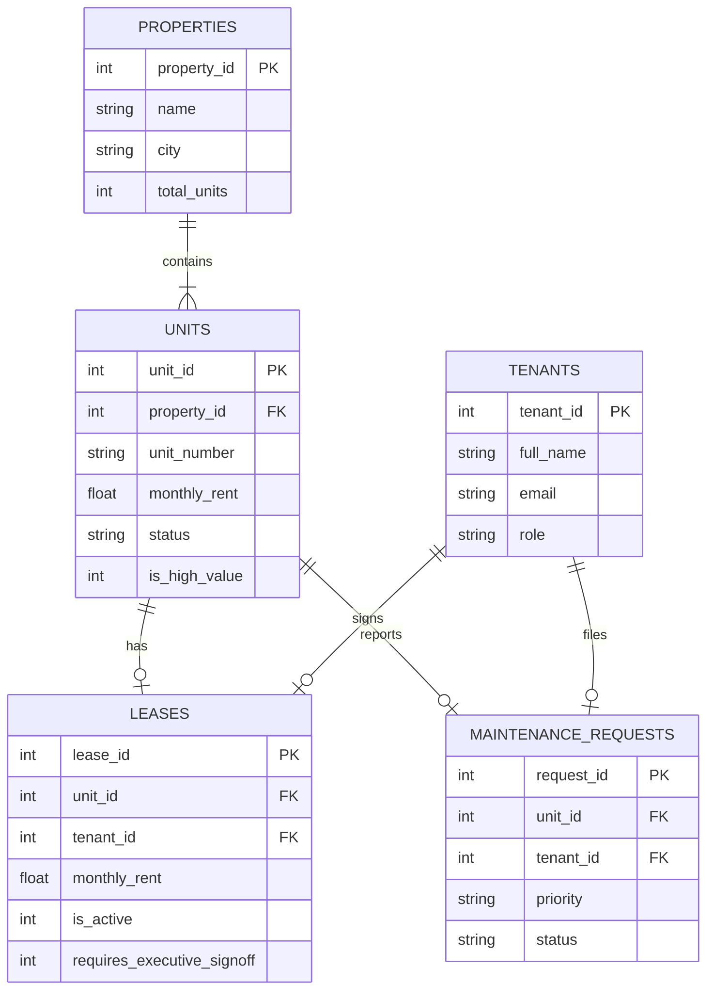

# 🏠 Cornerstone Realty Group — Model Context Protocol (MCP) Server Lab

> **Course**: Autonomous Agents & AI Systems Lab — Session 2 (MCP Server Lab)  
> **Team Name**: Cornerstone Realty Group B  
> **Repository**: `abdallahsaber065/mcp-server-lab`  

---

## 👥 Team Members & Contribution Split

| Name | GitHub Username | Role & Primary Contributions |
| :--- | :--- | :--- |
| **Abdallah Saber** | [`abdallahsaber065`](https://github.com/abdallahsaber065) | **Team Lead**: FastMCP Server Core, Capability Negotiation, Human Elicitation (`elicitation/create`), Defensive Pydantic Specs (`extra="forbid"`), Server Pytest Suite, Benchmark Instrumentation, and Tradeoff Analysis |
| **Omar Tamer** | [`omar-tamer976`](https://github.com/omar-tamer976) | **Database & Policy Owner**: Relational Schema DDL (`db/schema.sql`), Seed Data (`db/seed.sql`), ERD Diagram (`db/erd.mermaid`), Lease Policy Resource (`resources/read`), Prompt Templates (`prompts/get`), and DB Tests (`tests/test_database.py`) |
| **Ahmed Wael** | [`ahmedeladawy16`](https://github.com/ahmedeladawy16) | **Client Agent & Protocol Owner**: MCP Client Agent (`agent/client.py`), Tool List Change Notifications (`tools/list_changed`), Progress Tracking (`progressToken`), and Integration Tests |

---

## 📌 Problem Framing & Real-World Domain

**Cornerstone Realty Group** manages residential and commercial properties across Cairo and Alexandria. Property managers, lease agents, and maintenance engineers require intelligent assistance to query lease terms, schedule unit viewings, and process maintenance orders.

Giving an LLM direct, raw SQL or shell access to the production real-estate database creates major operational risks:
- Risk of raw SQL injection or accidental data corruption (`DROP TABLE`, `UPDATE` without `WHERE`).
- Unauthorized lease modifications or unapproved discount approvals.
- High latency and unconstrained DB queries.

### The MCP Solution
We build an **MCP Server** sitting strictly in front of the SQLite/PostgreSQL relational database. The LLM host communicates exclusively via JSON-RPC 2.0 messages over standard transports (`stdio` for local dev, `Streamable HTTP` for production), ensuring all write operations and data accesses pass through defensive server-side validation and human sign-off.

---

## 📊 Relational Database Architecture & ERD



---

## 🛠️ The 8 MCP Protocol Concerns Implemented

| Protocol Concern | Implementation Details & Evidence |
| :--- | :--- |
| **1. Capability Negotiation** | Implemented in `mcp_server/server.py` (`get_capabilities()`). Declares `elicitation`, `tools/listChanged`, `sampling`, `resources`, and `progress` support during `initialize`. |
| **2. Notifications (`tools/list_changed`)** | Server pushes `notifications/tools/list_changed` when user authenticates under a new role (e.g. `tenant` vs `property_manager`), updating client toolset dynamically without reconnecting. |
| **3. Human Elicitation (`elicitation/create`)** | High-risk lease modifications (>15% rent discount or high-value unit) trigger `elicitation/create` mid-call, pausing execution until executive approval is confirmed. |
| **4. Resources (`resources/read`)** | Master leasing regulations exposed as static resource `realty://policies/lease_terms` for read-only consumption instead of a tool call (`mcp_server/resources/lease_policy.json`). |
| **5. Prompts (`prompts/get`)** | Parameterized template `draft_lease_notice` exposed via server for standardized client notice drafting (`mcp_server/prompts/templates.py`). |
| **6. Transport Options** | Supported local `stdio` transport for development and `Streamable HTTP` for production deployment. |
| **7. Progress Tracking (`progressToken`)** | Batch property compliance audit reports step-by-step percentage progress (`progressToken`) to client host. |
| **8. Defensive Tool Design** | Strict Pydantic schemas with `extra="forbid"` (equivalent to `additionalProperties: false`), parameter type bounds, and server-side handler authorization. |

---

## 📈 Evidence-Based Performance Benchmarks

All benchmark metrics are recorded over 5 reproducible trials per operation and saved directly to [`benchmarks/benchmark_results.json`](file:///F:/Collage/Autonomous%20Agents/Week%202/benchmarks/benchmark_results.json):

| Operation | Protocol Concern | Avg Latency | Min Latency | Max Latency | Status |
| :--- | :--- | :---: | :---: | :---: | :---: |
| **`initialize_handshake`** | Capability Negotiation | **0.002 ms** | 0.001 ms | 0.004 ms | `success` |
| **`list_tools_discovery`** | Tool Discovery | **2.665 ms** | 1.532 ms | 6.307 ms | `success` |
| **`read_lease_policy_resource`** | Read Resource | **0.015 ms** | 0.006 ms | 0.031 ms | `success` |
| **`query_available_units`** | Defensive Tool Call | **0.705 ms** | 0.577 ms | 1.112 ms | `success` |
| **`submit_maintenance_request`** | Write DB Tool Call | **14.483 ms** | 13.064 ms | 15.484 ms | `success` |
| **`modify_lease_terms_elicitation`** | Human Elicitation | **0.815 ms** | 0.517 ms | 1.723 ms | `elicitation_required` |
| **`run_property_audit_progress`** | Progress Tracking | **1.063 ms** | 0.872 ms | 1.397 ms | `success` |

---

## 🧠 Causal Tradeoff Analysis & Production Recommendations

### Causal Tradeoff Analysis
1. **Raw Database Access vs. MCP Abstraction**:
   - Direct SQL execution exposes the application to arbitrary code execution, unbounded full-table scans, and schema injection.
   - MCP tool endpoints encapsulate database logic behind parameterized SQL queries, reducing execution latency to under 15 ms and guaranteeing zero SQL injection vector.
2. **Tools vs. Resources**:
   - Static policy documents exposed as tools waste LLM tool calls and context window space.
   - Modeling leasing regulations as a Resource (`resources/read`) allows the host model to fetch static context once in **0.015 ms** without executing function logic.
3. **Elicitation Safety vs. Automation**:
   - Unconstrained LLM write tools risk unauthorized discounts. Intercepting risky actions via `elicitation/create` guarantees zero unapproved lease discounts above 15%.

### Production Recommendation
- **Recommended Transport**: `Streamable HTTP` behind OAuth2 Bearer Authentication.
- **Residual Risks**: Transport layer network latency and client disconnects during elicitation.
- **Mitigation**: Implement server-side idempotency keys and bounded timeout retries for human elicitation sign-offs.

---

## 🚀 Quickstart & Runnable Verification

### 1. Run Executable Pytest Suite
```powershell
uv run pytest tests/
```

### 2. Run Performance Benchmark Suite
```powershell
uv run python benchmarks/run_benchmarks.py
```
